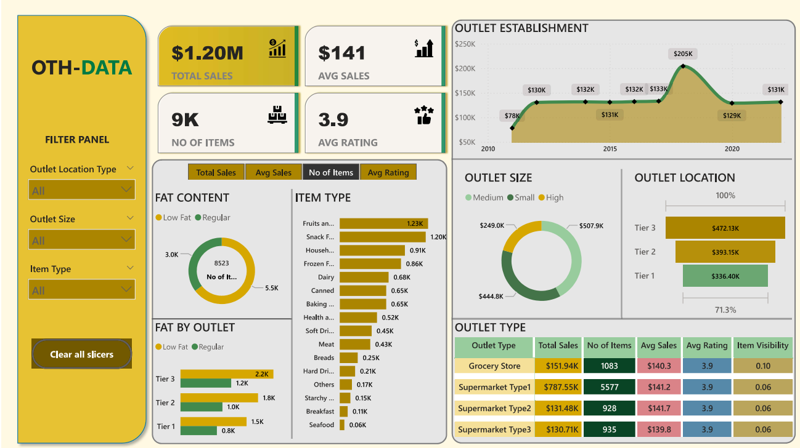
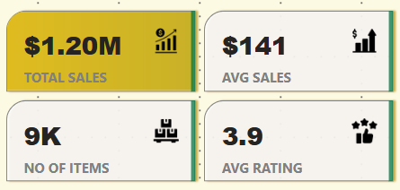
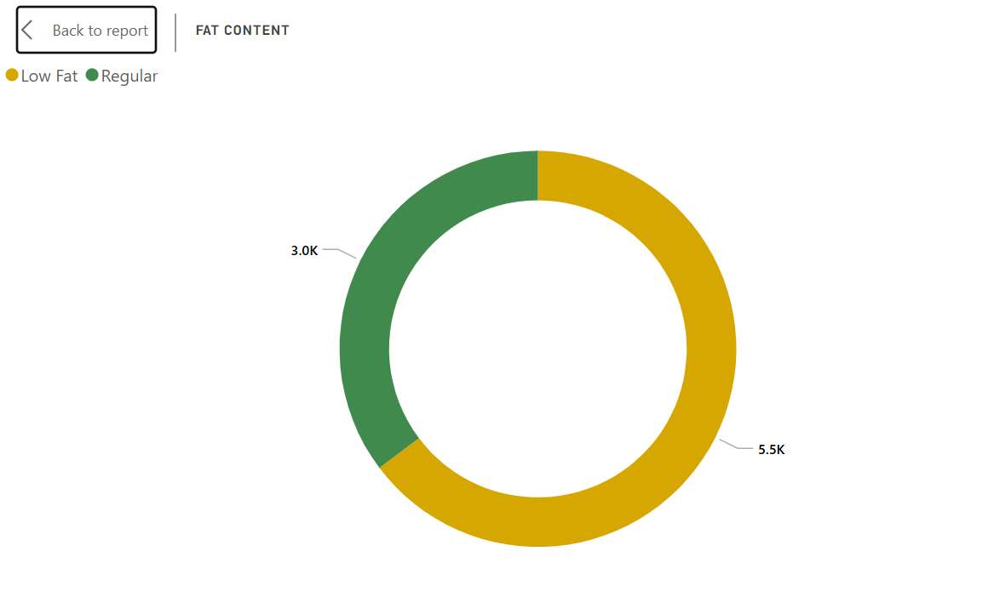
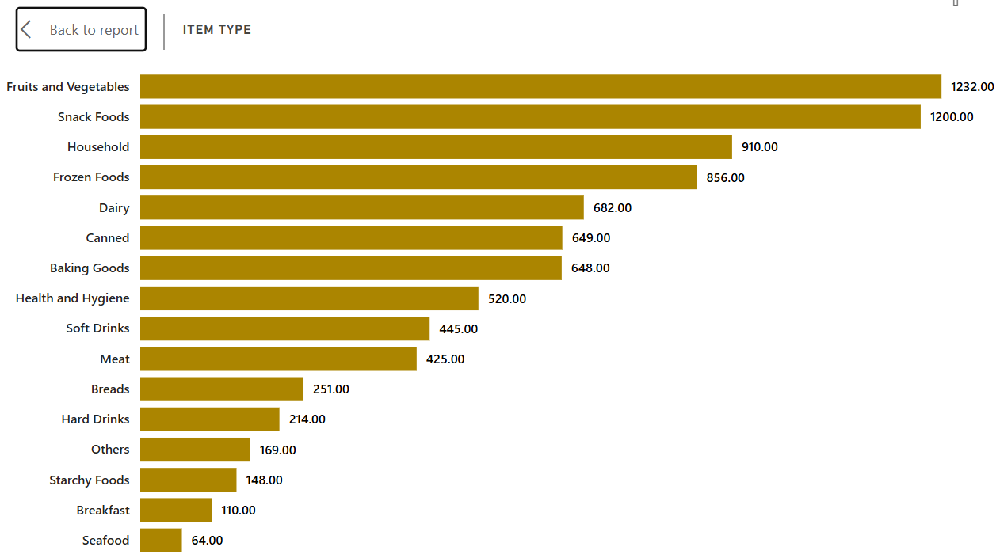
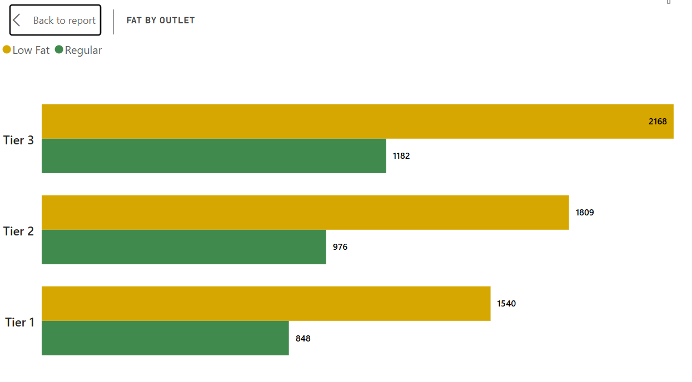
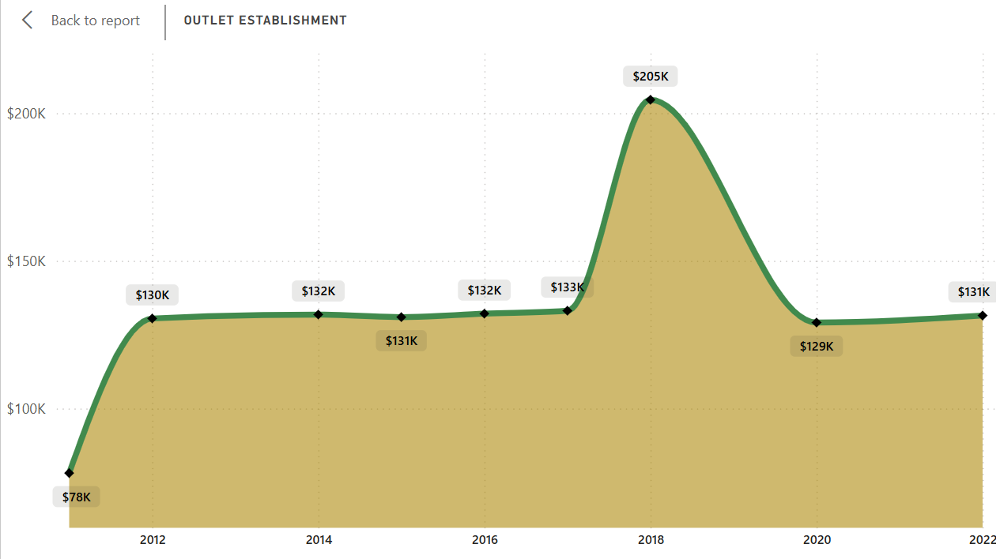
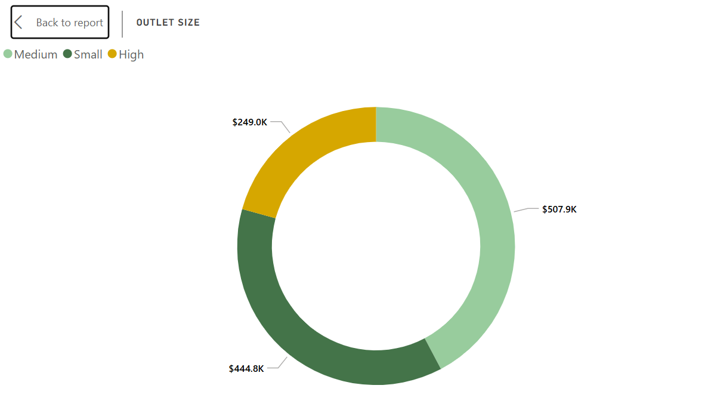
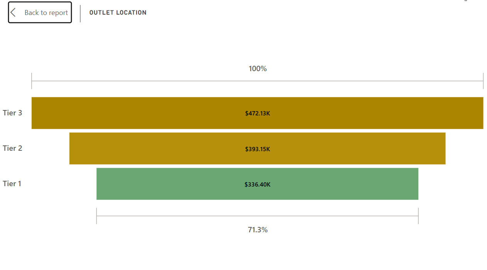
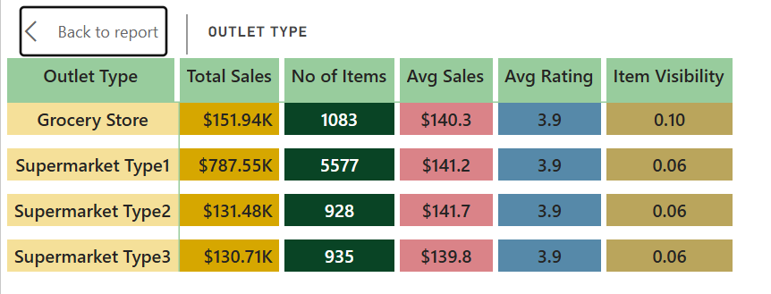

# Clothing-Store_Dashboard_by_POWER_BI


---
## Introduction

To conduct a comprehensive analysis of OTH-DATA Clothing sales performance, customer satisfaction, and inventory distribution to identify key insights and opportunities for optimization using various KPIs and visualizations in Power BI.

## Dashboard File

My final [dashboard](OTH-DATA.pdf)

## Problem statement

1. Analyze the impact of fat content on total sales.
2. Identify the performance of different item types in terms of total sales.
3. Compare total sales across different outlets segmented by fat content.
4. Evaluate how the age or type of outlet establishment influences total sales.
5. Analyze the correlation between outlet size and total sales. 
6. Assess the geographic distribution of sales across different locations. 
7. Provide a comprehensive view ot all key metrics ( total sales, Average Sales, Number ot Items, Average Hating) broken down by different outlet types. 

## Skills/ concepts demonstrated

- 🧮 Data Cleaning and Data Processing
- 📉 Charts and Visualization
- ❎ Conclusion and Recommendations

### 🧮 Data Cleaning and Dax :

- Total sales ;
```sql
Total Sales =

SUM
('BlinkIT Grocery Data (2)'[Sales])
```


- AVG Sales ;
```sql
Avg Sales =

AVERAGE
('BlinkIT Grocery Data (2)'[Sales])
```

- AVG Rating ;
```sql
Avg Rating =

AVERAGE
('BlinkIT Grocery Data (2)'[Rating])
```

- No of Items ;
```sql
No of Items =

COUNTROWS
('BlinkIT Grocery Data (2)')
```

- Metrics ;
```sql
METRICS =

{
    ("Total Sales", NAMEOF('BlinkIT Grocery Data (2)'[Total Sales]), 0),
    ("Avg Sales", NAMEOF('BlinkIT Grocery Data (2)'[Avg Sales]), 1),
    ("No of Items", NAMEOF('BlinkIT Grocery Data (2)'[No of Items]), 2),
    ("Avg Rating", NAMEOF('BlinkIT Grocery Data (2)'[Avg Rating]), 3)
}

```
### 📉 Charts and Visualization :

KPI's Requirements
1.	Total Sales: The overall revenue generated from all items sold.
2.	Average Sales: The average revenue per sale.
3.	Number of Items: The total count of different items sold.
4.	Average Rating: The average customer rating for items sold.


The report comprises 7 charts:

___1. Total Sales by Fat Content;___

___2. Total Sales by Item Type;___

___3. Fat Content by Outlet for Total Sales;___

___4. Total Sales by Outlet Establishment;___

___5. Sales by Outlet Size;___

___6. Sales by Outlet Location;___

___7. All Metrics by Outlet Type;___


 the all dashboard 

___KPI's Requirements___



___1. Total Sales by Fat Content;___



___Objective:__ Analyze the impact of fat content on total sales.
__Additional KPI Metrics:__ Assess how other KPIs (Average Sales, Number of Items, Average Rating) vary with fat content.
🤓_

___2. Total Sales by Item Type;___




___Objective:__ Identify the performance of different item types in terms of total sales.
__Additional KPI Metrics:__ Assess how other KPIs (Average Sales, Number of Items, Average Rating) vary with item type.
🤓_

___3. Fat Content by Outlet for Total Sales;___



___Objective:__ Compare total sales across different outlets segmented by fat content.
__Additional KPI Metrics:__ Assess how other KPIs (Average Sales, Number of Items, Average Rating) vary with fat content.
🤓_

___4. Total Sales by Outlet Establishment;___



___Objective:__ Evaluate how the age or type of outlet establishment influences total sales.🤓_

___5. Sales by Outlet Size;___



___Objective:__ Analyze the correlation between outlet size and total sales. 🤓_

___6. Sales by Outlet Location;___



___Objective:__ Assess the geographic distribution of sales across different locations. 🤓_

___7. All Metrics by Outlet Type;___



___objective:__ Provide a comprehensive view ot all key metrics ( total sales, Average Sales, Number ot Items, Average Hating) broken down by different outlet types. 🤓_


### ❎ Conclusion and Recommendations:

___Product Strategy:___ Focus on stocking and promoting high-performing item types identified in the analysis to maximize sales.


___Inventory Management:___ Align inventory distribution with regional preferences, especially concerning product attributes like fat content, to meet customer demand effectively.


___Outlet Development:___ Consider insights on outlet size, location, and type when planning new stores or refurbishing existing ones to optimize sales performance.


___Marketing Initiatives:___ Tailor marketing campaigns to highlight popular products and cater to regional tastes, as indicated by the sales data.


By implementing these recommendations, OTH-DATA Clothing Store can enhance its sales performance, improve customer satisfaction, and strategically plan for future growth.
